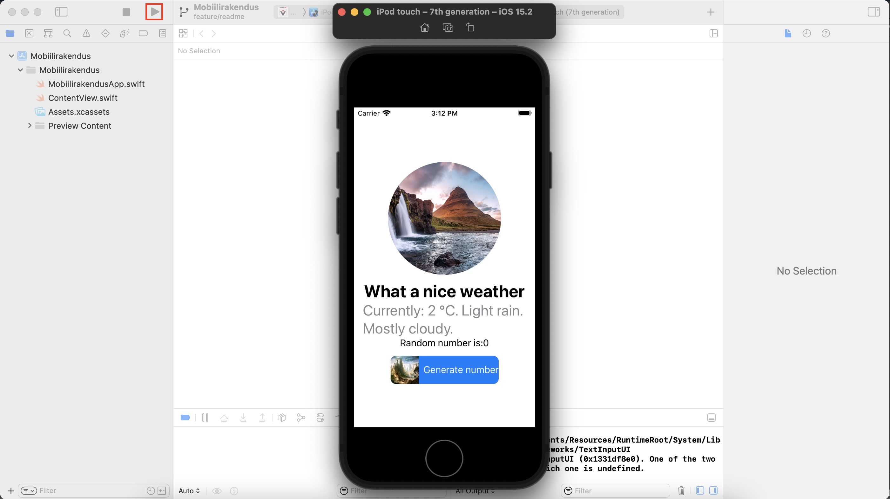

# Mobiilirakendused Grupp 1

## Äpi Setup

### Eeldused
* MacOS Operatsioonisüsteem
* Installeeritud Xcode
* Telefoniga testimiseks Iphone

### Setup
* Git clone repositoorium
* Ava Xcode
* Vali _open a project or file_
* Vali meie projekt
* Vajuta _Start the active scheme_ nuppu. Tuleb kiri: Build successful ning avaneb simulaatori vaade.
   
   
  
  
### Iphone'l testimine

[Õpetus](https://medium.com/nerd-for-tech/how-to-run-xcode-on-your-iphone-irene-bosque-783a2975534a)

Projekti initsialiseerimisel raskusi ei esinenud. 